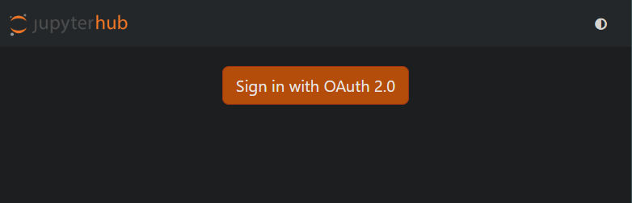
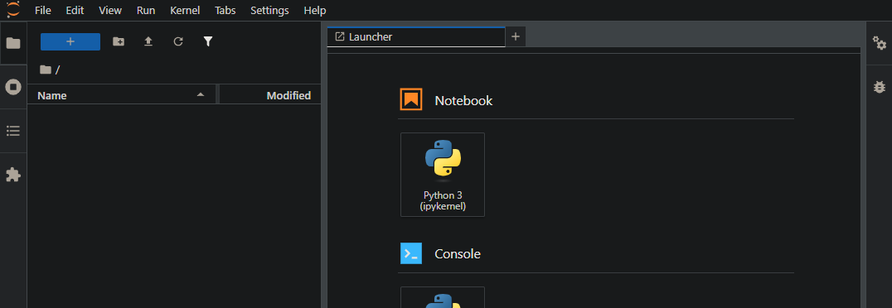

## Disclaimer
This is based on some code generated by AI, I have only made changes to fix the parts that were obviously broken in order to get a minimal "working" piece of code.

## Purpose
Proof of concept for an OIDC/OAuth2.0 Identity Provider built on Svelte as the UI and FastAPI as the backend API.
This has been tested with a JupyterHub instance.

## How this works

We have three components:
- A UI written in Svelte
- An API written in Python using FastAPI
- JupyterHub (our service provider, the resource the user actually wants to use)

Set all three of these up and run them at the same time, as described below.

Visit the JupyterHub URL (e.g. `https://jupyterhub.hostname:8000/`) and you'll see a page like this:

Click the big orange button and you'll be redirected to something like: `https://ui.hostname/login?response_type=code&client_id=jupyterhub-client&redirect_uri=https://jupyterhub.hostname:8000/hub/oauth_callback&scope=openid%20profile%20email&state=ggGggGG0GG9gGGG6GGGgGgGgG2GgGGGgG2G0GGG2GgGgGgG5G2GgGgG2GGggGgG9`

This happens because JupyterHub has told our user (via a 302 redirect) that they should visit `https://api.hostname:81/authorize?response_type=code&redirect_uri=https%3A%2F%2Fjupyterhub.hostname%3A8000%2Fhub%2Foauth_callback&client_id=jupyterhub-client&code_challenge=gGggg6gGGggGgGgG-0G7GG2ggggGGGggGgggGggGgGG&code_challenge_method=S256&state=ggGggGG0GG9gGGG6GGGgGgGgG2GgGGGgG2G0GGG2GgGgGgG5G2GgGgG2GGggGgG9&scope=openid+profile+email`. The API then sends a 307 redirect to the `/login` link above.

`/login` on the UI looks like:


The credentials from this example are in `main.py` of the backend code, and are currently defaulting to:
- Email: `user@example.com`
- Password: `123`

Obviously in the real world, this wouldn't be hard coded and so simple to guess, but it's quite handy when testing things out (when there's no danger of an attacker).

Entering those credentials and pressing `Login` will kick off the authentication by passing those credentials to the backend API.
The backend API then matches those against the credentials it expects, if incorrect, you don't log in and get a simple `{"detail":"Invalid credentials"}` as a response.

If the credentials do match, then the `/login` endpoint we were at responds with a 302 (redirect code). The user is then redirected back to `https://jupyterhub.hostname:8000/hub/oauth_callback&scope=openid%20profile%20email&state=ggGggGG0GG9gGGG6GGGgGgGgG2GgGGGgG2G0GGG2GgGgGgG5G2GgGgG2GGggGgG9`, as expected from the previous URL's `redirect_uri` parameter.

This callback URL needs to match in both the backend API and the JupyterHub config, as shown in the example config files.

From the user's perspective, they then get another 302 response to take them to the URL they should be at. I believe it'll just start your server automatically so you'll end up at `https://jupyterhub.hostname:8000/user/user123/lab`.

Behind the scenes, when the user arrives at the callback URL, JupyterHub (via `oauthenticator`) will make a request to the `/token` endpoint of the API to ensure that the user is indeed authenticated and correct. If so, it then makes a request to `/userinfo` on the API to get information. In our example that is `sub`, `email`, and `name`.

Our JupyterHub config says: `c.GenericOAuthenticator.username_claim = "sub"`, which means that the value of `sub` will be used to generate the username inside JupyterHub. I don't believe this is a magic variable, we should be able to change this to anything we like.

As you might expect, once authenticated to JupyterHub, you have access to a Jupyter instance:



## Setup
This can possibly be run on a single host, two hosts or three hosts.
I have tested it with the UI and API on one host and JupyterHub on a second host.

### Required for each host, but OS Specific (Rocky 8 here):
```sh
# Add prerequisites and generally helpful packages
dnf install -y epel-release && dnf install -y epel-release
dnf install -y vim git mlocate net-tools python3.11 python3.11-pip python3.11-devel wget unzip tar jq rsyslog chrony nload dnf-utils apptainer rsync gcc time httpd mod_ssl htop libatomic
# Set up system logging
systemctl start rsyslog
systemctl enable rsyslog
# Ensure time on system is kept correct
systemctl start chronyd
systemctl enable chronyd
# Ensure firewall is modified to allow connections on the required ports
# This will depend on which firewall you're using

# Install prerequisites for UI and JupyterHub (not required for API, but won't hurt)
# Install nvm
curl -o- https://raw.githubusercontent.com/nvm-sh/nvm/v0.40.4/install.sh | bash
# Install node which also installs npm
nvm install node
```

### UI

#### Setup
```sh
cd oidc-ui
npm install
```
I had Apache already setup and configured to be a proxy in front of this with the certificates set up so we can access this over https.

Example Apache config: `/etc/httpd/conf.d/proxypass.conf`
```ini
LoadModule ssl_module modules/mod_ssl.so

Listen 443 https

<VirtualHost *:443>
  # Disable TRACE/TRACK HTTP debugging
  TraceEnable           off
  ServerName            ui.hostname
  SSLEngine             on
  # Enable/Disable certain SSL protocols (+ for enable, - for disable)
  SSLProtocol           +TLSv1.2
  # Only allow these cipher suites
  SSLCipherSuite        ECDHE-ECDSA-AES128-GCM-SHA256:ECDHE-RSA-AES128-GCM-SHA256:ECDHE-ECDSA-AES256-GCM-SHA384:ECDHE-RSA-AES256-GCM-SHA384:ECDHE-ECDSA-CHACHA20-POLY1305:ECDHE-RSA-CHACHA20-POLY1305:DHE-RSA-AES128-GCM-SHA256:DHE-RSA-AES256-GCM-SHA384
  SSLHonorCipherOrder   off
  SSLSessionTickets     off

  SSLCertificateFile /etc/ssl/certs/my_cert.crt
  SSLCertificateKeyFile /etc/ssl/certs/my_cert.key
  SSLCertificateChainFile /etc/ssl/certs/my_cert.ca-bundle
  # Component specific rules
  SSLProxyEngine On

  ProxyPass / http://localhost:5173/
  ProxyPassReverse / http://localhost:5173/
  RewriteEngine On
  RewriteCond %{HTTP:Upgrade} =websocket [NC] !^api
  RewriteRule /(.*)           ws://localhost:5173/$1 [P,L]
</VirtualHost>
<VirtualHost *:80>
  ServerName ui.hostname
  Redirect permanent / https://ui.hostname/
</VirtualHost>
```

Start/Restart Apache (httpd) as necessary:
```sh
systemctl restart httpd
```

#### Configuration
Since this is just a quick demonstration, we don't have nice config files, instead we need to change any instances of `*.hostname` to the actual hostnames we want to use.

You can just search this repo for `.hostname` and you'll find three options (ignoring this `README.md`):
- `ui.hostname`
- `api.hostname`
- `jupyterhub.hostname`

These will need to be modified to the actual hostname these can be found at. For example:
- `host-172-16-111-111.host.ac.uk`
- `host-172-16-111-112.host.ac.uk`
- `host-172-16-111-113.host.ac.uk`

In the UI, these are in `callback.svelte` and `login.svelte` and should both be directed at the API hostname.


#### Running the UI in dev mode:
```sh
npm run dev
```


### API

#### Install the API prerequisites
```sh
cd backend
python3.11 -m venv venv
source venv/bin/activate
pip install fastapi uvicorn python-jose[cryptography] passlib[bcrypt] pydantic[email] python-multipart pydantic-settings bcrypt==4.0.1
```

#### Configuration
Since this is just a quick demonstration, we don't have nice config files, instead we need to change any instances of `*.hostname` to the actual hostnames we want to use.

You can just search this repo for `.hostname` and you'll find three options (ignoring this `README.md`):
- `ui.hostname`
- `api.hostname`
- `jupyterhub.hostname`

These will need to be modified to the actual hostname these can be found at. For example:
- `host-172-16-111-111.host.ac.uk`
- `host-172-16-111-112.host.ac.uk`
- `host-172-16-111-113.host.ac.uk`

For the API, these are in `config.py` and `main.py`.

#### Start the API
```sh
cd backend
source venv/bin/activate
uvicorn app.main:app --host 0.0.0.0 --reload --port 81 --ssl-keyfile=/etc/ssl/certs/my_cert.key --ssl-certfile=/etc/ssl/certs/my_cert.crt
```

### JupyterHub

#### Follow JupyterHub's quick start instructions to install software
```sh
python3.11 -m pip install jupyterhub
npm install -g configurable-http-proxy
# Include oauthenticator which we need for our OAuth setup
python3.11 -m pip install jupyterlab notebook oauthenticator
```

#### Insert config file
```sh
# See example in this repo
vim jupyterhub_config_generic_oauth.py
```
The hostnames need to be changed, as do the certificate paths.
You can just search this repo for `.hostname` and you'll find three options (ignoring this `README.md`):
- `ui.hostname`
- `api.hostname`
- `jupyterhub.hostname`

These will need to be modified to the actual hostname these can be found at. For example:
- `host-172-16-111-111.host.ac.uk`
- `host-172-16-111-112.host.ac.uk`
- `host-172-16-111-113.host.ac.uk`

For JupyterHub config, these are the `OIDC_BASE` which is the URL for our API, and `oauth_callback_url` which is the url we send users back to after they've logged in to the UI.

#### Ensure that Python accepts your certificates
Python might not trust the certificate you have on your API, so you'll need to check this and install the certificate on this host if it doesn't trust it.

You can check this by starting the same Python that JupyterHub uses.
In our case `python3.11` and running the following:
```python
import ssl, socket

HOSTNAME = "api.hostname"
PORT = 81
ctx = ssl.create_default_context()
with socket.create_connection((HOSTNAME, PORT)) as sock:
    with ctx.wrap_socket(sock, server_hostname=HOSTNAME) as ssock:
        print("OK:", ssock.version())
```
If all is well, you'll get an output like:
>OK: TLSv1.3

Otherwise you may get:
>ssl.SSLCertVerificationError: [SSL: CERTIFICATE_VERIFY_FAILED] certificate verify failed: unable to get local issuer certificate (_ssl.c:1016)

This is the same exception we would get in JupyterHub if the certificate isn't trusted.

```sh
# Install certificate to trust store
cp /etc/ssl/certs/my-cert-chain.crt /etc/pki/ca-trust/source/anchors/
update-ca-trust
```

#### Start JupyterHub
We start this with a parameter which chooses the config file to load. Otherwise it will default to using a file called `jupyterhub_config.py` in this directory if available.
- `-f` lets us choose this file, so we do that here to be more explicit.
- `--ip=0.0.0.0` makes the server listen to network connections rather than just localhost (we need this if we're accessing JupyterHub from a host other than the local one, alternatively a proxy of some kind can be used)
```sh
jupyterhub -f jupyterhub_config_generic_oauth.py --ip=0.0.0.0
```
